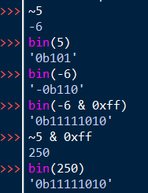
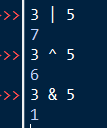
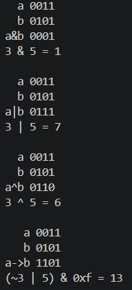

# Домашняя работа 1

fix: [Добавил эксперименты на пайтон с битовыми операциями](#эксперименты-с-числами-и-битовыми-операциями)

## ~(a & b) | ~(a | c)

Я попробовал упростить выражение

```
~(a & b) | ~(a | c) = (~a | ~b) | (~a & ~c) = ~a | (~a & ~c) | ~b = ~a | ~b = ~(a & b)
```

Вручную посчитал таблицу

| a | b | c | r |
|--|--|--|--|
| 0 | 0 | 0 | 1 |
| 0 | 0 | 1 | 1 |
| 0 | 1 | 0 | 1 |
| 0 | 1 | 1 | 1 |
| 1 | 0 | 0 | 1 |
| 1 | 0 | 1 | 1 |
| 1 | 1 | 0 | 0 |
| 1 | 1 | 1 | 0 |

Программно (посчитал оригинальное и упрощенное выражение они совпали)

[exp1.py](src/exp1.py)
```
print('| a | b | c | r1 | r2 |')
print('|--|--|--|--|--|')
for a in range(2):
    for b in range(2):
        for c in range(2):
            r1 = ~(a & b) | ~(a | c) # оригинальное выражение
            r2 = ~(a & b) # упрощенное выражение
            # нам нужен только младший бит (потому что ~ инвертирует все биты)
            r1 &= 1
            r2 &= 1
            print(f'| {a} | {b} | {c} | {r1} | {r2} |')
```

| a | b | c | r1 | r2 |
|--|--|--|--|--|
| 0 | 0 | 0 | 1 | 1 |
| 0 | 0 | 1 | 1 | 1 |
| 0 | 1 | 0 | 1 | 1 |
| 0 | 1 | 1 | 1 | 1 |
| 1 | 0 | 0 | 1 | 1 |
| 1 | 0 | 1 | 1 | 1 |
| 1 | 1 | 0 | 0 | 0 |
| 1 | 1 | 1 | 0 | 0 |


## (a & b) | (~b & c) 

Вручную посчитал таблицу

| a | b | c | r |
|--|--|--|--|
| 0 | 0 | 0 | 0 |
| 0 | 0 | 1 | 1 |
| 0 | 1 | 0 | 0 |
| 0 | 1 | 1 | 0 |
| 1 | 0 | 0 | 0 |
| 1 | 0 | 1 | 1 |
| 1 | 1 | 0 | 1 |
| 1 | 1 | 1 | 1 |

Программно

[exp2.py](src/exp2.py)
```
print('| a | b | c | r |')
print('|--|--|--|--|')
for a in range(2):
    for b in range(2):
        for c in range(2):
            r = (a & b) | (~b & c)
            # нам нужен только младший бит (потому что ~ инвертирует все биты)
            r &= 1
            print(f'| {a} | {b} | {c} | {r} |')
```

| a | b | c | r |
|--|--|--|--|
| 0 | 0 | 0 | 0 |
| 0 | 0 | 1 | 1 |
| 0 | 1 | 0 | 0 |
| 0 | 1 | 1 | 0 |
| 1 | 0 | 0 | 0 |
| 1 | 0 | 1 | 1 |
| 1 | 1 | 0 | 1 |
| 1 | 1 | 1 | 1 |

# (a & b) | ~c

Вручную посчитал таблицу

| a | b | c | r |
|--|--|--|--|
| 0 | 0 | 0 | 1 |
| 0 | 0 | 1 | 0 |
| 0 | 1 | 0 | 1 |
| 0 | 1 | 1 | 0 |
| 1 | 0 | 0 | 1 |
| 1 | 0 | 1 | 0 |
| 1 | 1 | 0 | 1 |
| 1 | 1 | 1 | 1 |

Программно

[exp3.py](src/exp3.py)
```
print('| a | b | c | r |')
print('|--|--|--|--|')
for a in range(2):
    for b in range(2):
        for c in range(2):
            r = (a & b) | ~c
            # нам нужен только младший бит (потому что ~ инвертирует все биты)
            r &= 1
            print(f'| {a} | {b} | {c} | {r} |')

```

| a | b | c | r |
|--|--|--|--|
| 0 | 0 | 0 | 1 |
| 0 | 0 | 1 | 0 |
| 0 | 1 | 0 | 1 |
| 0 | 1 | 1 | 0 |
| 1 | 0 | 0 | 1 |
| 1 | 0 | 1 | 0 |
| 1 | 1 | 0 | 1 |
| 1 | 1 | 1 | 1 |

## Исходники

Исходники положил в [src](src/)

[make_tab.py](src/make_tab.py) использовал для создания таблиц, которые заполнял вручную

## Эксперименты с числами и битовыми операциями

### Операция ~ (инверсия)

В начале я попробовал инверсию.



По первым строчкам видно, что т. к. в питоне нет беззнаковых чисел и нет ограничения на число бит в числе есть проблема с выводом результатов битовых операций после инверсии.
Я это решил при помощи выделения младших 8-ми бит при помощи операции `& 0xff`

### Операции или (|), исключающее или (^), и (&)



Эти операции ведут себя прогнозируемо. 

Я специально взял значения 3 (0b11) и 5 (0b101) чтобы были все комбинации из двух бит

### Программа с битовыми операциями

Потом я попробовал получить таблицы истинности для логических операций не перебирая все возможные варианты, а задав a = 3, b = 5

[Исходный код](src/bit_op.py)

Результат работы


