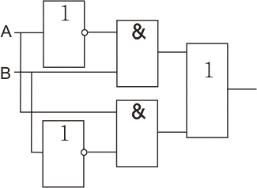
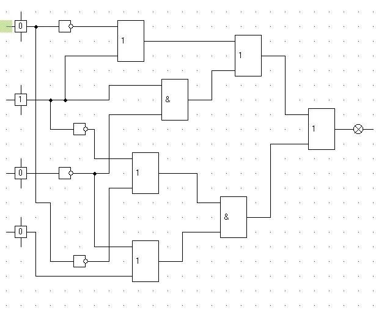
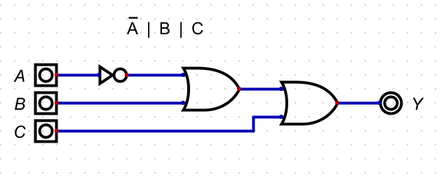
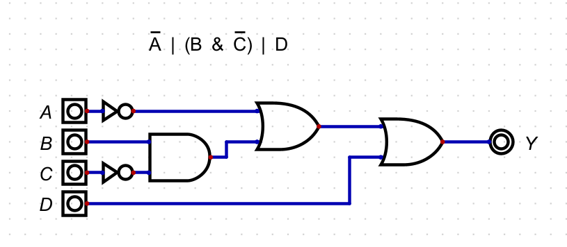

# Домашняя работа 2

## 1 Часть из схемы в формулу.

### 1

`(~A & B) | (B & ~A)`

### 2

`~A | B | B & ~C | A & B & (~C | D)`

## 2 часть из формулы в схему

### 3  

`(A∧¬B)→(C∨¬A)`

Избавимся от импликации

(A∧¬B)→(C∨¬A) = ~(A & ~B) | C | ~A = ~A | B | C | ~A = ~A | B | C

[Исходный файл](src/sch3.dig)

### 4

`¬(A∧(B→C))∨D`

Избавимся от импликации

¬(A∧(B→C))∨D = ~(A & (~B | C)) | D = ~A | (B & ~C)  | D

