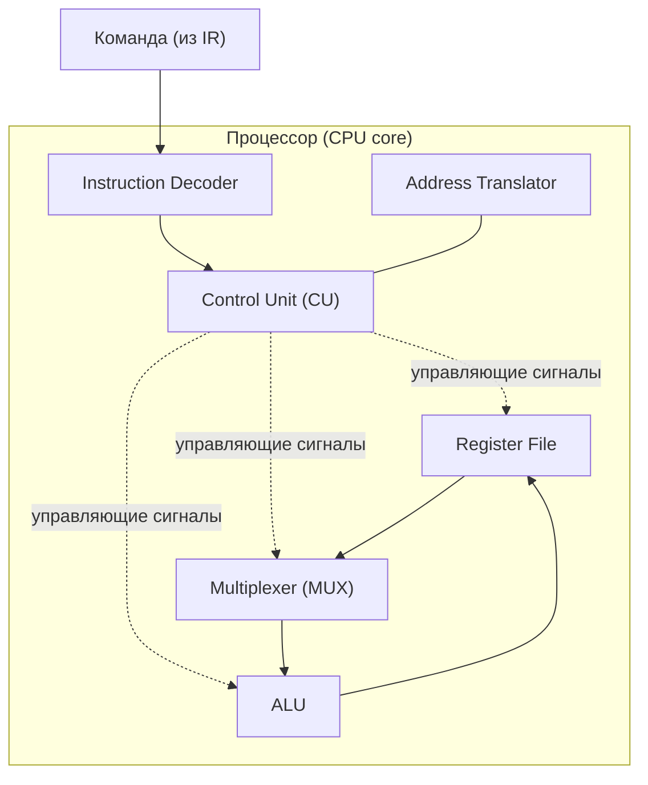
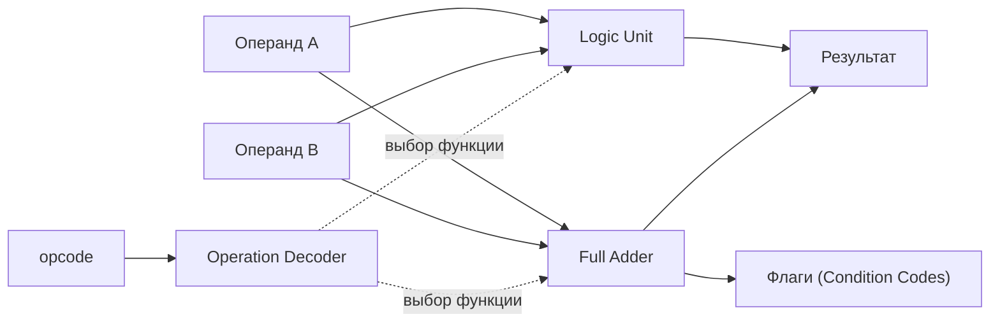
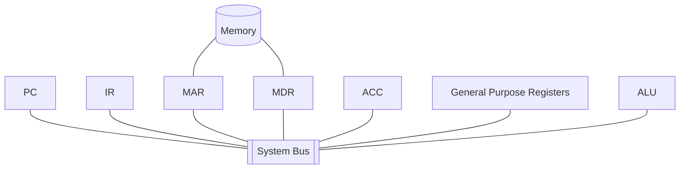
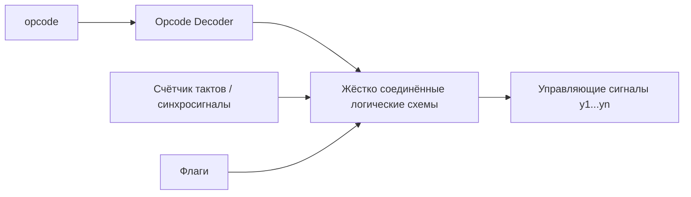
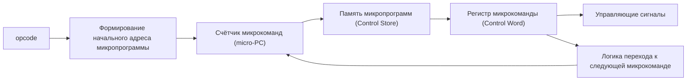
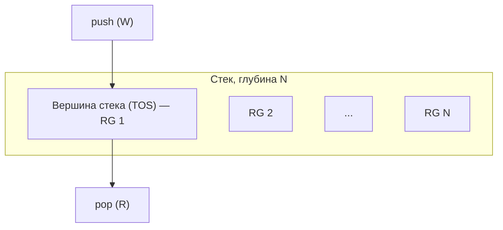
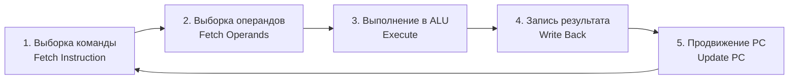
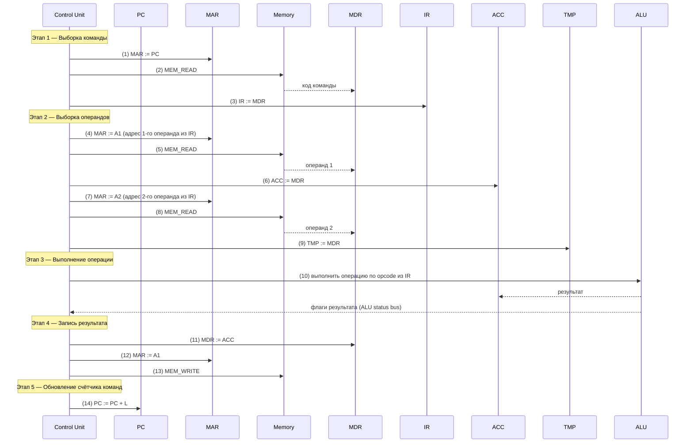
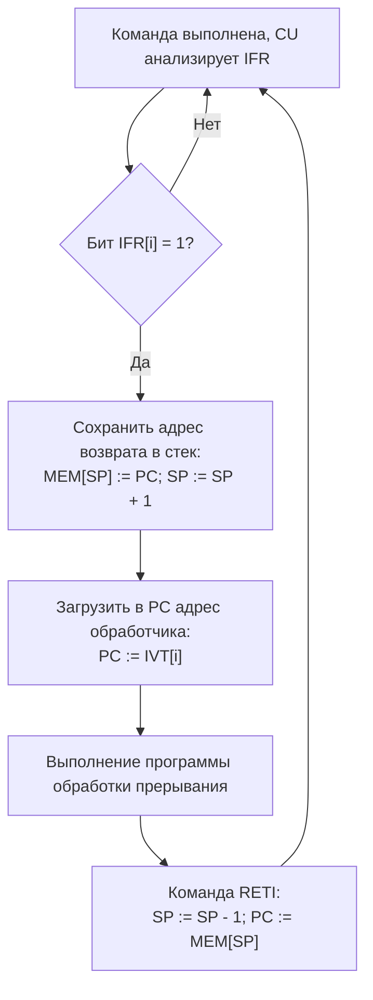

# Архитектура микропроцессоров — конспект

## Содежание

1. [Используемы обозначения](#1-используемы-обозначения)
2. [Что такое процессор](#2-что-такое-процессор)
3. [Структура ядра процессора](#3-структура-ядра-процессора)
4. [Операционные устройства](#4-операционные-устройства)
5. [Устройство управления (Control Unit)](#5-устройство-управления-control-unit)
6. [Архитектуры системы команд](#6-архитектуры-системы-команд)
7. [Рабочий цикл процессора](#7-рабочий-цикл-процессора)
8. [Прерывания](#8-прерывания)
9. [Особенности i8086](#9-особенности-i8086)

## 1. Используемы обозначения

> В презентациях часть схем было с английскими обозначениями, а часть с русскими и не очень понятными аббревиатурами. Я сделал табличку обозначений со стандартным обозначениям, принятым в англоязычной литературе по архитектуре ЭВМ.

| Из лекции | Стандартное обозначение | Значение |
|---|---|---|
| РК | **IR** | Instruction Register — регистр команды |
| СчАК, СК | **PC** | Program Counter — счётчик команд (счётчик адреса команды) |
| ПортА | **MAR** | Memory Address Register — регистр адреса памяти (выставляется на шину адреса) |
| ПортД | **MDR** | Memory Data Register — регистр данных памяти (выставляется на шину данных) |
| РАОП, РСОП | **MAR / MDR** (со стороны памяти) | Те же регистры, но физически расположенные в блоке памяти |
| Р1 (аккумулятор АЛУ) | **ACC** | Accumulator — первый регистр-операнд АЛУ, приёмник результата |
| Р2 | **TMP** | Второй регистр-операнд АЛУ |
| АЛУ | **ALU** | Arithmetic Logic Unit |
| УУиС, УУ | **CU** | Control Unit — устройство управления (и синхронизации) |
| DC (дешифратор КОП) | **OpDec** | Opcode Decoder |
| ЧтОП | **MEM_READ** | Сигнал чтения памяти |
| ЗпОП | **MEM_WRITE** | Сигнал записи в память |
| ШАЛУ | **ALU status bus** | Шина осведомительных сигналов/флагов АЛУ |
| РПР | **CCR** | Condition Code Register — регистр признака результата |
| РФ (флаги прерываний) | **IFR** | Interrupt Flag Register |
| РМ | **IMR** | Interrupt Mask Register |
| УС | **SP** | Stack Pointer — указатель стека |
| ТВП | **IVT** | Interrupt Vector Table — таблица векторов прерываний |
| КОП | **opcode** | Код операции |
| РОН | **GPR** | General Purpose Registers — регистры общего назначения |

---

## 2. Что такое процессор

Процессор в каждый момент времени выполняет **программу** — последовательность команд, преобразующих входные данные в результат. Команды и данные исполняемой программы хранятся в оперативной памяти (**Memory**); их выборку и исполнение делает процессор.

Два базовых вопроса, на которые отвечает архитектура процессора:
- в каком виде хранятся данные и команды (представление чисел, символов, битовых векторов);
- откуда процессор знает, где в памяти находится очередная команда и операнды для неё (роль **PC** и полей адреса в команде).

**Историческая справка.** Первый микропроцессор — **Intel 4004** (1971 г.): вычислительная мощность на уровне ENIAC, но при этом 2300 транзисторов на кристалле размером с ноготь, тактовая частота 108 КГц, потребление — десятки ватт, цена — $200.

---

## 3. Структура ядра процессора

Основные элементы, из которых строится ядро процессора:

- **Instruction Decoder** — дешифратор команд;
- **ALU** — арифметико-логическое устройство (операционное устройство);
- **CU** — устройство управления;
- **Registers** — регистры;
- **Address Translator** — транслятор адресов операндов;
- **Buses** — шины, связывающие узлы между собой.

### 3.1 Регистры

**Регистр** — линейка триггеров с входами управления состоянием, влияющим на выходы. По видимости для программиста регистры делятся на:

- **программно-видимые явно** — доступны командам напрямую (GPR, флаги и т. п.);
- **видимые косвенно** — например, "теневые" регистры дескрипторов сегментов;
- **внутренние специального назначения** — MAR, MDR и подобные, чьё назначение фиксировано;
- **внутренние для промежуточных результатов** — не видны программисту вообще.

### 3.2 Мультиплексор

Простейший **MUX** выбирает один из нескольких входных сигналов на единственный выход по управляющему коду — базовый элемент для маршрутизации данных между регистрами и ALU внутри датапути.

### 3.3 Шины и комбинационные схемы

- **Шины** — связывают регистры, служат для передачи слов данных;
- **Комбинационные схемы** — реализуют вычисления по управляющим сигналам от CU (в отличие от регистров, не хранят состояние).

Эти три компонента (регистры, шины, комбинационные схемы) образуют **структурный базис** — набор элементов, на основе которых строятся операционные устройства для целочисленной арифметики, логических операций, сдвигов, десятичной арифметики, чисел с плавающей точкой, графики и т. д.

---

## 4. Операционные устройства

### 4.1 ALU — состав

**ALU** — комбинационная схема (без внутренней памяти), принимающая два операнда (например, из двух регистров) и формирующая результат операции.

Состав ALU:
- **Logic Unit** — логическое устройство (AND/OR/XOR/NOT и т. п.);
- **Full Adder** — полный сумматор;
- **Operation Decoder** — декодер операции, по коду операции выбирающий нужную функцию.

### 4.2 Простейшие операционные устройства

Примеры элементарных операций датапути:

| Операция | Пример команды | Что происходит |
|---|---|---|
| Пересылка | `mov R1, R2` | Содержимое R2 копируется в R1 через шину/MUX |
| Сдвиг | `rol R0` | Содержимое R0 циклически сдвигается в комбинационной схеме сдвига |
| Сложение | `add R0, R1` | R0 и R1 подаются на входы ALU, результат — в R0 |

### 4.3 Датапуть с общей шиной (Von Neumann machine)

Типовая связка операционных устройств с памятью через единую шину — классический однобашинный датапуть:

**Операционный блок с магистральной структурой (ОПБ)** — обобщение этой схемы: все регистры и ALU подключены к одной (или нескольким) внутренним магистралям, а CU коммутирует, кто в данный такт читает/пишет на шину.

---

## 5. Устройство управления (Control Unit)

### 5.1 Функции CU

CU реализует управление ходом вычислительного процесса, обеспечивая автоматическое выполнение команд программы:

- формирует сигналы выборки очередной команды из памяти;
- дешифрирует код операции;
- формирует адреса операндов и организует их выборку из памяти;
- передаёт операнды в ALU и инициирует выполнение операции;
- передаёт результат из ALU обратно в память;
- инициирует операции ввода-вывода;
- организует реакцию на запросы прерывания.

### 5.2 Базовые понятия

- **Микрооперация** — элементарное действие, выполняемое за один такт синхронизации;
- **Микрокоманда** — набор одновременно выполняемых микроопераций;
- **Микропрограмма** — последовательность микрокоманд, реализующая один машинный цикл (одну команду).

### 5.3 Состав CU

**Управляющая часть** (на основе декодирования команды формирует последовательность микрокоманд):
- регистр команды (IR);
- микропрограммный автомат + дешифратор команд (OpDec);
- узел прерываний и приоритетов.

**Адресная часть** (формирует адреса команд и операндов в памяти):
- операционный узел устройства управления;
- регистр адреса (MAR);
- счётчик команд (PC).

### 5.4 Два способа реализации CU

| | Hardwired control (жёсткая логика) | Microprogrammed control (программируемая логика) |
|---|---|---|
| Принцип | Управляющие сигналы формируются один раз спроектированными, "жёстко" соединёнными логическими схемами | Каждой команде соответствует **микропрограмма**, хранящаяся в памяти микропрограмм; выполнение — интерпретация |
| Скорость | Выше (нет обращений к памяти микрокоманд) | Ниже (дополнительный уровень интерпретации) |
| Гибкость / изменение системы команд | Низкая — требует перепроектирования схемы | Высокая — достаточно изменить содержимое памяти микропрограмм |
| Аппаратные затраты | Выше при сложной системе команд | Ниже — HW выполняет только ограниченный набор микрокоманд |
| Историческая роль | Современные высокопроизводительные процессоры (гибкость важнее экономии HW) | Идея предложена Морисом Уилксом в 1951 г. (Кембридж); доминировала к 1970-м, затем уступила место hardwired-подходу с ростом требований к производительности |

Дополнительно в лекции разбирался **пример процессора с тремя шинами**, иллюстрирующий, как микропрограммный автомат управляет пересылками данных сразу между тремя внутренними магистралями (расширение однобашинной схемы из §4.3).

---

## 6. Архитектуры системы команд

Ключевой вопрос при выборе архитектуры системы команд (Instruction Set Architecture, ISA) — **где хранятся операнды и как к ним обращаются**. Выделяют 4 вида:

| Архитектура | Где хранятся операнды | Как адресуются | Примеры |
|---|---|---|---|
| Стековая (Stack) | В стеке | Неявно — всегда вершина стека | Ранние реализации, Forth-машины |
| Аккумуляторная (Accumulator) | Один операнд — в аккумуляторе, второй — в памяти | Один операнд неявный (ACC) | Ранние ЭВМ, простые МК |
| Регистровая (Register) | Регистры и/или память | Явно, номер регистра/адрес | x86 (CISC) |
| С выделенным доступом к памяти (Load-Store) | Только регистры (GPR) | Обращение к памяти — только `load`/`store` | SPARC, MIPS R10000, DEC Alpha, PowerPC (RISC) |

### 6.1 Стековая архитектура

**Стек** — память из связанных ячеек, работающая по принципу **LIFO** (Last In, First Out). Бывает программным, аппаратным или реализованным на регистрах сдвига. Операции: **push** (запись в вершину) и **pop** (чтение/удаление из вершины) — запись возможна только в верхнюю ячейку.

Стек снижает издержки на адресацию: все данные идентифицируются положением вершины стека, явные адреса операндов не нужны.

**Обратная польская запись (RPN)**, предложенная Я. Лукашевичем, — естественная форма записи вычислений для стековых машин: скобки не нужны, знак операции следует за операндами (постфиксная форма), порядок операций определяется приоритетами.

> Пример: выражение `a = a + b + a·c` в постфиксной форме — `a b + a c × +`.

### 6.2 Аккумуляторная архитектура

**Аккумулятор (ACC)** — регистр, хранящий один из операндов и результат арифметической/логической операции. Для выполнения операции: второй операнд считывается из памяти в регистр данных, ACC и регистр данных подключены к входам ALU, результат по завершении операции заносится обратно в ACC.

Команды:
- `load x` — загрузка содержимого ячейки `x` в ACC;
- `store x` — сохранение содержимого ACC в ячейку `x`.

**Плюсы:** короткие команды, простое декодирование.
**Минусы:** единственный регистр → частые обращения к памяти.

### 6.3 Регистровая архитектура

Процессор содержит массив регистров — **регистровый файл (GPR)**, который можно рассматривать как явно управляемый кэш для часто используемых данных. Размер регистра обычно равен размеру машинного слова; обращение — по номеру регистра.

- **CISC** — как правило, небольшое число GPR;
- **RISC** — существенно больше GPR (до нескольких сотен).

Подвиды команд обработки: регистр–регистр, регистр–память, память–память.

**Плюсы:** компактный код, высокая скорость (обращения к регистрам вместо памяти).
**Минусы:** более длинные инструкции по сравнению с аккумуляторной архитектурой.

### 6.4 Архитектура с выделенным доступом к памяти (Load-Store)

Обращение к памяти возможно **только** через команды `load` и `store`. Все команды обработки работают исключительно с операндами в GPR, результат — тоже в регистр. Прямого обращения к памяти в командах обработки нет.

Характерна для RISC-архитектур: команды обычно 32-битные, трёхадресный формат. Примеры процессоров: **Sun SPARC, MIPS R10000, DEC Alpha, PowerPC**.

---

## 7. Рабочий цикл процессора

Рассматривается упрощённый, но достаточный для понимания вариант — исполнение **двухадресной арифметической/логической команды**.

### 7.1 Аппаратное обеспечение

**Регистры процессора:**

| Обозначение | Назначение |
|---|---|
| IR | Хранит выбранную команду на всём протяжении её выполнения |
| MAR (со стороны процессора) | Порт адреса — выставляет адрес на шину адреса |
| MDR (со стороны процессора) | Порт данных — связь с шиной данных |
| ACC | Первый регистр ALU — аккумулятор |
| TMP | Второй регистр ALU |
| PC | Счётчик адреса очередной команды |

**Регистры памяти:** MAR и MDR со стороны блока памяти (принимают адрес/слово с шины).

**Прочие узлы:** ALU, шина адреса, шина данных, шина управления, CU, генератор синхросерии, OpDec (дешифратор КОП).

Чтение из памяти: CU выставляет адрес в MAR и вырабатывает `MEM_READ` → данные появляются в MDR памяти → передаются по шине данных в MDR процессора.
Запись в память: CU выставляет адрес в MAR, данные — в MDR, и вырабатывает `MEM_WRITE`.

### 7.2 Пять этапов рабочего цикла

> Этап 5 логически можно выполнить сразу после этапа 1 (PC используется только на этапе 1, дальше свободен) — в лекции оставлен последним для наглядности.

### 7.3 Детальный разбор по сигналам

Ниже — полная последовательность управляющих сигналов (в оригинале `y1…y14`) для одной двухадресной арифметической команды, в приведённых к стандартным именам обозначениях:

где **L** — длина выполненной команды в байтах.

### 7.4 Синхронизация с ALU и признак результата

ALU — асинхронный относительно CU блок: на выходе `ALU status bus` есть бит **"занято/свободно"** (в лекции `ШАЛУ(8)`). Пока идёт выполнение микропрограммы операции, ALU держит его в 1; CU ожидает (**поллинг**), пока бит не станет 0 — это означает, что результат в ACC готов.

Помимо самого результата, для операций сложения/вычитания/инкремента/декремента/поразрядных логических AND/OR/XOR ALU формирует унитарный код признака результата:

| Бит ALU status bus | Условие |
|---|---|
| bit 0 | ACC = 0 |
| bit 1 | ACC < 0 |
| bit 2 | ACC > 0 |
| bit 3 | переполнение с фиксированной точкой |

Кодером (**Coder**) этот унитарный код преобразуется в двухразрядный позиционный код и сохраняется в **CCR** (00 — ноль, 01 — меньше нуля, 10 — больше нуля, 11 — переполнение). Другие (не арифметические/логические) команды содержимое CCR не меняют.

Дополнительные флаги исключительных ситуаций для операций с плавающей точкой и деления (переполнение/исчезновение порядка, потеря значимости, деление на 0) фиксируются отдельно в регистре флагов прерываний (**IFR**), т. к. именно оттуда их разбирает система прерываний.

### 7.5 Команды перехода

После арифметической/логической команды PC всегда продвигается на длину команды — переход к следующей по порядку. Для организации ветвлений и циклов служат **команды перехода**.

Пример — **условный переход по маске**: поле опкода задаёт код операции, поле маски **M** сравнивается с текущим значением CCR, поле **A** — адрес перехода.
- M и A = все нули → переход не выполняется (аналог "нет операции");
- M = все единицы → переход выполняется всегда (безусловный переход);
- иначе → если CCR соответствует M, в PC записывается A, иначе PC продолжает обычную последовательность. Признак результата (CCR) при этом не меняется.

---

## 8. Прерывания

Прерывание — переключение процессора с текущей программы на программу обработки прерывания при возникновении особого события.

**Типы прерываний:**

| Тип | Причина | Маскируется? |
|---|---|---|
| Исключения (exceptions) | Ошибка при выполнении текущей команды (деление на 0, переполнение и т. п.) | Нет |
| Внешние (external) | Запрос от внешнего устройства, таймера (например, квант времени в мультипрограммном режиме) | Да |

### 8.1 Аппаратная поддержка

- **IFR** — регистр флагов прерываний: i-й бит соответствует i-й причине прерывания;
- **IMR** — регистр масок: установка i-го бита отключает обработку соответствующего прерывания (не все прерывания маскируемы);
- **SP** — указатель стека: хранит адрес свободной верхушки стека для сохранения адреса возврата;
- **IVT** — таблица векторов прерываний: первые n слов памяти (в гарвардской архитектуре — памяти программ), i-е слово которой содержит команду безусловного перехода на первую команду обработчика i-го прерывания.

### 8.2 Алгоритм обработки

Если после выполнения команды в IFR установлено несколько битов одновременно, применяется процедура опроса прерываний с учётом приоритетов (подробно — в курсе "Операционные системы").

### 8.3 Ограничение простой векторной схемы

Классическая схема с IVT сохраняет только адрес возврата (PC). Если обработчик прерывания меняет значения регистров специального назначения или GPR, их сохранение/восстановление — забота программиста обработчика (сохранить в память/стек на входе, восстановить перед RETI). В более развитых системах при прерывании автоматически сохраняется/восстанавливается более широкий контекст — **Program Status Word (PSW)**, объединяющее CCR, IMR и другие спецрегистры.

---

## 9. Особенности i8086

**Регистр флагов процессора 8086:**

| Флаг | Название | Значение |
|---|---|---|
| CF | Carry Flag | флаг переноса |
| PF | Parity Flag | флаг чётности |
| AF | Auxiliary Carry Flag | флаг вспомогательного переноса |
| ZF | Zero Flag | флаг нуля |
| SF | Sign Flag | флаг знака |
| TF | Trap Flag | флаг пошаговой отладки |
| IF | Interrupt-Enable Flag | флаг разрешения прерывания |
| DF | Direction Flag | флаг направления строковых команд |
| OF | Overflow Flag | флаг переполнения |

**Классификация и особенности набора команд i8086:**
- относится к классу **CISC**;
- всего 538 команд (целочисленные — 210, с плавающей точкой — 85, MMX — 57, MMX Pentium III — 16, XMM — 70);
- базовая структура команд обработки — двухоперандная: один операнд всегда в регистре, второй — в регистре либо в памяти;
- длина команды — от 1 до 15 байт, форматы кодирования нерегулярны;
- используются сложные многокомпонентные способы адресации;
- регистровая модель не вполне ортогональна — многие регистры узкоспециализированы;
- команды пересылки (`mov` и т. п.) не изменяют флаги.

**Сегментная организация памяти:** логический адрес — пара `сегмент:смещение` (например, `ds:bx`). Регистры сегментов: `cs` (код), `ds` (данные), `ss` (стек), `es` (доп. сегмент). Модели памяти: Tiny, Small, Medium, Compact, Large, Huge.
